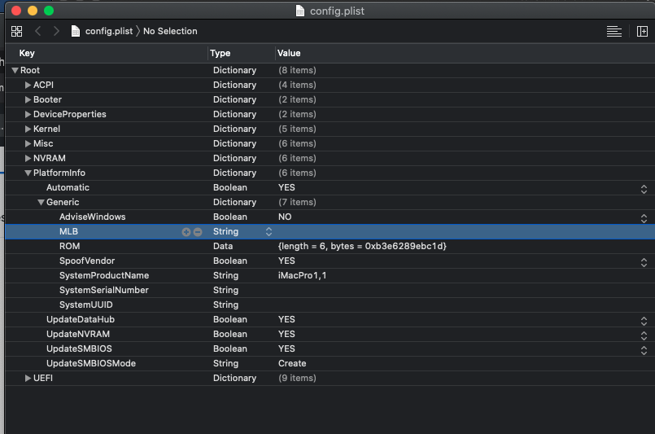

# Ryzen5-3600-Rx570-OpenCore
OpenCore(0.5.9) bootloader, for ryzen cpu and rx500 gpu
## My Hardware
| Hardware       | Model                                   |
| -------------- | --------------------------------------- |
| CPU            | Ryzen5 3600                             |
| Motherboard    | msi mortar b450m                        |
| GPU            | Rx580 2048sp, but flashed a rx570 vbios |
| nvme1          | Hikvision C2000Pro 512g                 |
| nvme2          | Plextor M9PEG  512g                     |
| WIFI&BLUETOOTH | Broadcom BCM94360                       |

## Warning!

+ I have removed my platform info, including a valid serial number and UUID and so on. Make sure you generate a these info before putting this EFI in to use !!